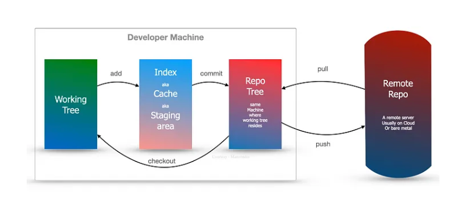

# TestNG

### Why TestNG
TestNG (Test Next Generation) is a testing framework primarily used in Java programming language for automation testing. 
When it comes to Selenium, TestNG offers several advantages:

Annotations: TestNG provides annotations (like @Test, @BeforeMethod, @AfterMethod, etc.) 
which help in organizing and prioritizing test cases easily. These annotations make test scripting simpler and more readable.

Parameterization: TestNG allows parameterization of test methods, 
which means you can run the same test case with different sets of data. This is particularly useful for data-driven testing.

Grouping: TestNG allows grouping of test cases, 
which makes it easier to categorize and run tests based on specific criteria. This feature is handy for regression testing, where you might want to run only a subset of tests.

Dependency Testing: TestNG supports dependencies between test methods, 
meaning you can specify the order in which tests should be executed. This ensures that certain tests are run only if their dependent tests pass successfully.

Parallel Execution: TestNG allows running tests in parallel, 
which can significantly reduce the overall test execution time, especially when dealing with a large number of test cases.

Reporting: TestNG generates detailed HTML reports after test execution, 
providing information such as test case status, execution time, errors, and stack traces. These reports are easy to read and understand, facilitating better analysis of test results.

Listeners: TestNG allows implementing custom listeners to perform additional actions before or after certain test events, 
such as test case pass/fail, suite start/finish, etc. This provides flexibility in extending TestNG's functionality as per specific requirements.

### Data providers – to run same tests with different number of data
    In TestNG, a data provider is a mechanism that allows you to pass data sets to your test methods. 
    This feature enables data-driven testing, where the same test method can be executed multiple times with different sets of data.

### Parallel Execution
    Tests can be run in parallel by setting the parallel attribute in testNG xml file.

## How to set up testNG

### Add maven dependency

    <dependency>
        <groupId>org.testng</groupId>
        <artifactId>testng</artifactId>
        <version>7.4.0</version> <!-- or the latest version -->
        <scope>test</scope>
    </dependency>

## Annotations in testNG
    @BeforeSuite
    @BeforeTest
    @BeforeClass
    @BeforeMethod
    @Test 
    @AfterMethod
    @AfterClass
    @AfterTest
    @AfterSuite
## Run the sample class
    Create class with methods for each annotation. add your test implementation in @Test
## Other features

### Priority
    @Test(priority = 1)
    public void firstTestMethod() {
    // Test logic
    }
    
    @Test(priority = 2)
    public void secondTestMethod() {
    // Test logic
    }
### Groups
    @Test(groups = "regression")
    public void testMethod3() {
    // Test logic
    }

    <suite name="TestSuite">
        <test name="Test">
            <groups>
                <run>
                    <include name="sanity" />
                    <!-- <exclude name="regression" /> -->
                </run>
            </groups>
            <classes>
                <class name="com.example.TestClass" />
            </classes>
        </test>
    </suite>

### Depends on
####  DependsOnMethods
        
        @Test
        public void loginTest() {
        // Test logic for login
        }
        
        @Test(dependsOnMethods = { "loginTest" })
        public void searchTest() {
        // Test logic for searching
        }

#### dependsOnGroups

        @Test(groups = "login")
        public void loginTest() {
        // Test logic for login
        }
        
        @Test(dependsOnGroups = { "login" })
        public void searchTest() {
        // Test logic for searching
        }

### Report html
    TestNG automatically generate report file in html format named index.html

### Data provider example

    import org.testng.annotations.DataProvider;
    import org.testng.annotations.Test;
    
    public class ExampleTest {
    
        // Define the data provider method
        @DataProvider(name = "testData")
        public Object[][] testData() {
            return new Object[][] {
                { "John", 30 },
                { "Jane", 25 },
                { "Doe", 35 }
            };
        }
    
        // Test method that consumes data from the data provider
        @Test(dataProvider = "testData")
        public void testMethod(String name, int age) {
            System.out.println("Name: " + name + ", Age: " + age);
            // Your test logic using the provided data
        }
    }

### Retry
    
    Create a class that implements the IRetryAnalyzer interface. This interface contains a single method retry() that returns a boolean value indicating whether the test method should be retried.
    import org.testng.IRetryAnalyzer;
    import org.testng.ITestResult;
    
    public class RetryAnalyzer implements IRetryAnalyzer {
    
        private int retryCount = 0;
        private static final int MAX_RETRY_COUNT = 3;
    
        @Override
        public boolean retry(ITestResult result) {
            if (retryCount < MAX_RETRY_COUNT) {
                retryCount++;
                return true;
            }
            return false;
        }
    }


# Maven project

Apache Maven is a powerful build automation tool primarily used for Java projects. It simplifies the process of building, managing, and deploying Java-based applications by providing a standardized project structure, dependency management, and build lifecycle.

## POM 
Project Object Model (POM), an XML file named pom.xml, to describe the project's configuration and dependencies.

## Dependency Management:
Maven simplifies dependency management by allowing developers to specify project dependencies in the POM file.
Dependencies are automatically downloaded from remote repositories and added to the project's classpath during the build process.
## Project Structure:

project-name
├── src
│   ├── main
│   │   ├── java           (Java source code)
│   │   ├── resources      (Non-Java resources, such as configuration files)
│   │   └── webapp         (Web application resources, for web projects)
│   │       └── WEB-INF    (Web application configuration files)
│   └── test
│       ├── java           (Test source code)
│       └── resources      (Test resources)
├── target                 (Output directory for compiled code and generated artifacts)
├── pom.xml                (Project Object Model - project configuration file)
└── README.md              (Project documentation)

the above structure used by test automation project too, but with the following change

project-name
├── src
│   ├── main
│   │   ├── java           (Java class file like step definition, utilities)
│   │   ├── resources      (Non-Java resources, such as configuration files)
│   └── test
│       ├── java           (Test Runner java files)
│       └── resources      (non java test files like feature files, data)
├── target                 (Output directory for compiled code and generated artifacts)
├── pom.xml                (Project Object Model - project configuration file)
└── README.md              (Project documentation)

## Build Lifecycle:

validate: Validates the project structure and configuration.

compile: Compiles the source code of the project.

test: Runs unit tests for the compiled source code.

package: Packages the compiled code into distributable formats such as JAR, WAR, or EAR files.

verify: Verifies the integrity and correctness of the packaged code.

install: Installs the packaged artifact into the local repository for use in other projects.

deploy: Copies the packaged artifact to a remote repository for sharing with other developers or deployment to production environments.

## Plugin Architecture:
Maven provides a rich ecosystem of plugins that extend its functionality and support various tasks such as compiling code, running tests, packaging applications, generating documentation, and more.

## Central Repository:

maven maintains the dependency here to get downlaoded by POM.xml
https://mvnrepository.com/artifact/org.seleniumhq.selenium/selenium-java

## How to install
Install maven in the system like java.
https://maven.apache.org/download.cgi

## Maven project create
choose project type as Maven when creating project in intelliJ
## Add dependency
add necessary dependencies to pom.xml

# Git
Source code management tool.

## Git architecture



## How to install from git-scm

https://git-scm.com/downloads

## How to push new repo to remote

Initialize Git repository
git init

Add files to staging area
git add .

Commit changes
git commit -m "Initial commit"

Link to remote repository
git remote add origin <remote-url>

Push changes to remote repository
git push -u origin main

## How to clone from remote repo (resource 2)

1. Obtain the Repository URL:
2. Open Terminal or Command Prompt:
3. Navigate to the Directory Where You Want to Clone the Repository:
   cd path/to/parent-directory
4. Clone the Repository:
   git clone <repository-url>
   git clone https://github.com/user/repo.git
5. Authenticate (if required):

## How to raise pull request and merge to master
1. clone the repo
git clone https://github.com/<your-username>/<repository>.git
2. Create a New Branch:
git checkout -b <branch-name>
3. Make and Commit Changes:
      git add .
      git commit -m "Your commit message"
4Push Changes to Your Fork:
git push origin <branch-name>
5. Create Pull Request:
      Navigate to your forked repository on GitHub, and you should see an option to create a pull request from the branch you just pushed. Click on the "New pull request" button.

6. Compare Changes:
   In the pull request page, select the base repository and branch (usually the original repository and main/master branch), and compare it with your forked repository and the branch where you made your changes.

7. Provide Details:
   Provide a title and description for your pull request. Explain the changes you've made and why they are necessary.

8. Create Pull Request:
   Click the "Create pull request" button to create the pull request. This will notify the maintainers of the original repository about your changes and allow them to review and merge your code.
9. Wait for Review and Merge:
    Wait for the maintainers of the original repository to review your pull request. They may ask for changes or provide feedback before merging your changes into the main codebase.

## How to pull other changes
git pull origin your-branch-name
OR
git checkout your-branch-name

## How to resolve merge conflict 

To resolve a merge conflict in Git, follow these steps:

### 1. Identify the Merge Conflict:
When you attempt to merge branches with conflicting changes, Git will notify you of the conflict. You'll typically see a message indicating that there are merge conflicts and which files are affected.

### 2. Open the Conflicting File(s):
Open the conflicting file(s) in a text editor. Git will mark the conflicting sections with special markers like `<<<<<<<`, `=======`, and `>>>>>>>`, indicating the conflicting changes from different branches.

### 3. Resolve the Conflict:
Manually edit the conflicting sections of the file(s) to resolve the conflict. You'll need to decide which changes to keep, modify, or discard. Remove the conflict markers and ensure the final content reflects the desired outcome.

### Example:
Suppose you have a conflict in a file `example.txt`:
```plaintext
<<<<<<< HEAD
This is the content from the current branch.
=======
This is the content from the branch you're merging in.
>>>>>>> branch-name
```
You need to edit the file to keep the desired content, like so:
```plaintext
This is the content from the current branch and the branch you're merging in.
```

### 4. Save the Changes:
Once you've resolved the conflict, save the changes to the file(s) in your text editor.

### 5. Add the Resolved File(s):
After resolving the conflict, stage the resolved file(s) for the commit using the `git add` command.

```bash
git add example.txt
```

### 6. Commit the Changes:
Commit the resolved changes with a descriptive commit message explaining how you resolved the conflict.

```bash
git commit -m "Resolved merge conflict in example.txt"
```

### 7. Verify and Push Changes:
After committing the resolved changes, verify that there are no more conflicts in your repository. You can then push the changes to the remote repository.

```bash
git push
```

### Additional Notes:
- If you're unsure how to resolve a conflict, you can seek assistance from your team members or review the conflicting changes carefully to understand the implications.
- It's essential to resolve merge conflicts promptly to avoid blocking progress on the project and maintain a clean and stable codebase.

By following these steps, you can effectively resolve merge conflicts in Git and ensure that conflicting changes are reconciled appropriately.